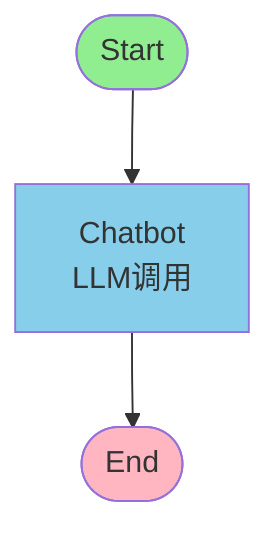
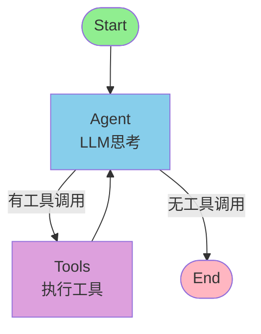

# T05 - LangGraph 基础入门

> **课程来源**：黑马程序员 LangChain 课程 第3章 Agent 进阶
> **参考视频**：[BV178w1z7EHQ](https://www.bilibili.com/video/BV178w1z7EHQ)

---

## 1. 从 LangChain Agent 到 LangGraph 的演进

### 1.1 LangChain Agent 的局限性

在 LangChain 早期版本中，我们通过 `create_react_agent` 或 `AgentExecutor` 来构建 Agent。这种方式虽然简单易用，但随着应用复杂度的提升，逐渐暴露出以下问题：

| 局限 | 具体表现 |
|------|----------|
| **黑盒循环** | Agent 内部的推理-行动循环对开发者不透明，难以理解执行流程 |
| **状态不透明** | 中间状态被封装在 Executor 内部，无法在外部访问或修改 |
| **调试困难** | 出错时很难定位是哪个环节出了问题，缺乏细粒度的 Trace |
| **扩展性差** | 想要添加自定义逻辑（如条件分支、并行执行）非常困难 |
| **固定模式** | 只支持 ReAct 等预设的循环模式，无法灵活定制工作流 |

```python
# 传统 LangChain Agent 的典型写法（黑盒模式）
from langchain.agents import create_react_agent, AgentExecutor
from langchain.tools import Tool

agent = create_react_agent(llm, tools, prompt)
agent_executor = AgentExecutor(agent=agent, tools=tools, verbose=True)
result = agent_executor.invoke({"input": "查询北京天气"})

# 问题：整个过程是个黑盒，我们无法控制中间的每一步
```

### 1.2 LangGraph 的诞生背景

为了解决上述问题，LangChain 团队在 2024 年初推出了 **LangGraph** —— 一个专门用于构建有状态、多步骤应用的库。

**核心理念**：将 Agent 的执行过程从"黑盒循环"拆解为"可视化的图结构（Graph）"

```
传统 Agent 执行模型：
┌─────────────────────────────────────┐
│         AgentExecutor (黑盒)          │
│  ┌───────┐    ┌───────┐    ┌─────┐  │
│  │ 思考   │ →  │ 行动   │ →  │ 观察 │  │ (循环)
│  └───────┘    └───────┘    └─────┘  │
│         ↓ 输出结果                   │
└─────────────────────────────────────┘

LangGraph 执行模型：
┌─────────────────────────────────────────────┐
│              StateGraph (可视化)              │
│                                             │
│   ┌─────┐     ┌─────┐     ┌─────┐          │
│   │START│ →   │Node1│ →   │Node2│ → END     │
│   └─────┘     └──┬──┘     └─────┘          │
│                    ↑                         │
│               条件边 (Conditional Edge)      │
│                    ↓                         │
│                ┌─────┐                      │
│                │Node3│                      │
│                └─────┘                      │
└─────────────────────────────────────────────┘
```

### 1.3 LangGraph 与 LangChain 的关系

> **重要澄清**：LangGraph **不是** LangChain 的替代品，而是其上层的编排层（Orchestration Layer）

```
┌─────────────────────────────────────────────────┐
│                  应用层 (Your App)               │
├─────────────────────────────────────────────────┤
│              LangGraph (编排层)                  │
│    · 定义图的拓扑结构 (StateGraph)               │
│    · 管理节点间的数据流 (State/Edge)             │
│    · 控制执行流程 (条件分支/HITL)               │
├─────────────────────────────────────────────────┤
│            LangChain Core (基础层)               │
│    · LLM 调用 (ChatModel)                       │
│    · 消息类型 (Messages)                        │
│    · 工具定义 (Tools)                           │
│    · 提示词模板 (PromptTemplate)                │
│    · 输出解析 (Output Parser)                   │
├─────────────────────────────────────────────────┤
│              LLM Provider (模型层)               │
│    · OpenAI / Anthropic / 本地模型 等           │
└─────────────────────────────────────────────────┘
```

**协作关系**：

| 组件 | 职责 |
|------|------|
| **LangChain Core** | 提供 LLM 调用、消息处理、工具定义等基础能力 |
| **LangGraph** | 将这些基础能力组织成复杂的、有状态的执行流程 |

---

## 2. LangGraph 四大核心原语

LangGraph 的设计围绕四个核心概念展开，理解它们是掌握 LangGraph 的关键：

### 2.1 核心原语总览

| 原语 | 英文 | 说明 | 类比 |
|------|------|------|------|
| **状态** | State | 全局共享的数据容器，在节点间传递 | 工厂的数据总线 |
| **节点** | Node | 执行单元，是一个 Python 函数 | 加工站/工序 |
| **边** | Edge | 连接节点的转移规则 | 传送带/流水线 |
| **图** | Graph | 包含所有节点和边的有向图整体 | 整个工厂 |

### 2.2 State（状态）—— 数据总线

State 是 LangGraph 中最重要的概念，它是整个图执行过程中的**全局共享状态**。

#### 为什么需要 State？

在没有显式状态管理的系统中，节点间传递数据通常通过函数参数和返回值实现。但在复杂的工作流中：

- 多个节点需要访问同一份数据
- 需要维护完整的执行历史
- 支持时间旅行（回溯到历史状态）

#### State 的定义方式

使用 Python 的 `TypedDict` 来定义状态的结构：

```python
from typing import TypedDict, Annotated
from langgraph.graph.message import add_messages

class GraphState(TypedDict):
    """定义图的全局状态结构"""

    # 消息列表：使用 add_messages reducer 追加消息
    messages: Annotated[list, add_messages]

    # 自定义字段
    query: str                    # 用户原始查询
    search_results: list          # 搜索结果
    answer: str                   # 最终答案
    iteration_count: int          # 循环计数器
```

#### Annotated 与 Reducer 模式

`Annotated[type, reducer]` 是 LangGraph 的核心机制之一：

```python
from typing import Annotated

# add_messages 是 LangGraph 内置的 reducer
# 它的行为是：新消息追加到列表末尾，而不是替换整个列表
messages: Annotated[list, add_messages]

# 这意味着：
# 初始状态: {"messages": [msg1]}
# 节点返回: {"messages": [msg2]}
# 更新后:   {"messages": [msg1, msg2]}  ← 追加，不是替换！
```

**常用内置 Reducer**：

| Reducer | 行为 | 使用场景 |
|---------|------|----------|
| `add_messages` | 追加消息到列表 | 对话历史管理 |
| `operator.add` | 列表拼接 | 结果收集 |
| `operator.or_` | 字典合并 | 配置合并 |
| `lambda x, y: y` | 直接替换（默认） | 简单值更新 |
| 自定义函数 | 任意归约逻辑 | 复杂状态更新 |

#### 自定义 Reducer 示例

```python
from operator import add

class ResearchState(TypedDict):
    # 使用 add 进行列表拼接
    findings: Annotated[list, add]  # 多个节点的发现会合并

    # 使用替换策略（默认行为）
    current_topic: str

    # 自定义 reducer：保留最新的 N 个结果
    recent_results: Annotated[list, lambda old, new: (old + new)[-5:]]

def custom_reducer(existing: dict, update: dict) -> dict:
    """自定义合并逻辑"""
    return {**existing, **update}  # 新值覆盖旧值
```

### 2.3 Node（节点）—— 执行单元

Node 是图中的基本计算单元，本质上就是一个 **Python 函数**。

#### 节点的签名规范

```python
def my_node(state: GraphState) -> dict:
    """
    节点函数的标准签名

    Args:
        state: 当前图的完整状态（TypedDict）

    Returns:
        dict: 需要更新的状态字段（不需要返回完整状态）
    """
    # 1. 从 state 中读取所需数据
    messages = state["messages"]
    user_query = state["query"]

    # 2. 执行业务逻辑
    response = llm.invoke(messages)
    result = some_tool.run(user_query)

    # 3. 返回需要更新的字段（partial update）
    return {
        "messages": [response],
        "search_results": result,
        "answer": response.content
    }
```

#### 关键规则

| 规则 | 说明 |
|------|------|
| **输入** | 接收完整的 State 作为参数 |
| **输出** | 返回需要更新的字段字典（partial update） |
| **副作用** | 可以调用外部 API、数据库等 |
| **纯函数推荐** | 尽量无副作用，便于测试和调试 |

#### 不同类型的节点示例

```python
# 类型1: LLM 调用节点
def chatbot_node(state: GraphState) -> dict:
    """调用 LLM 生成回复"""
    response = llm.invoke(state["messages"])
    return {"messages": [response]}

# 类型2: 工具执行节点
def tool_executor_node(state: GraphState) -> dict:
    """执行工具调用"""
    last_message = state["messages"][-1]
    tool_calls = last_message.tool_calls

    results = []
    for tool_call in tool_calls:
        tool = tools_by_name[tool_call["name"]]
        output = tool.invoke(tool_call["args"])
        results.append(
            ToolMessage(content=output, tool_call_id=tool_call["id"])
        )

    return {"messages": results}

# 类型3: 路由/判断节点（通常用于条件边）
def router_node(state: GraphState) -> str:
    """判断下一步去向（返回字符串）"""
    last_message = state["messages"][-1]
    if last_message.tool_calls:
        return "tools"
    return "end"
```

### 2.4 Edge（边）—— 转移规则

Edge 定义了节点之间的连接关系和控制流转。

#### 边的类型

```
┌────────────────────────────────────────────────────┐
│                     Edge 类型                       │
├──────────────────┬─────────────────────────────────┤
│   普通边         │  add_edge(A, B)                 │
│   ─────────      │  A 执行完后 → 总是去 B           │
│                  │                                 │
│   条件边         │  add_conditional_edges(         │
│   ─────────      │      A,                         │
│                  │      {cond1: B, cond2: C},      │
│                  │      route_func                 │
│  )               │  )                              │
│                  │  A 执行完后 → 根据条件选择去向    │
│                  │                                 │
│   入口边         │  add_edge(START, A)             │
│   ─────────      │  图的开始节点                    │
│                  │                                 │
│   出口边         │  add_edge(A, END)               │
│   ─────────      │  图的结束节点                    │
└──────────────────┴─────────────────────────────────┘
```

#### START 和 END 特殊节点

LangGraph 定义了两个特殊的常量节点：

```python
from langgraph.graph import START, END

# START：图的入口，每个图必须有且仅有一个入口
graph.add_edge(START, "first_node")

# END：图的出口，到达此节点表示执行结束
graph.add_edge("last_node", END)

# 一个节点也可以直接指向 END（终止执行）
graph.add_conditional_edges(
    "decision",
    {"continue": "next_step", "stop": END},
    should_continue
)
```

### 2.5 Graph（图）—— 容器与编译器

Graph 是所有节点和边的容器，负责将它们组织成可执行的应用。

#### StateGraph 类

```python
from langgraph.graph import StateGraph

# 创建图实例，绑定状态类型
graph = StateGraph(GraphState)

# 添加节点
graph.add_node("node_name", node_function)

# 添加边
graph.add_edge("node_a", "node_b")
graph.add_conditional_edges(...)

# 编译为可执行应用
app = graph.compile()
```

---

## 3. 第一个 LangGraph 程序

让我们从最简单的例子开始 —— 构建一个单节点的 Chatbot。

### 3.1 完整代码示例

```python
# ============================================
# 第一个 LangGraph 程序：简单 Chatbot
# ============================================

# 1. 导入必要的模块
from langgraph.graph import StateGraph, START, END
from langchain_core.messages import (
    SystemMessage,
    HumanMessage,
    AIMessage
)
from typing import TypedDict, Annotated
from langgraph.graph.message import add_messages
from langchain_openai import ChatOpenAI

# 2. 定义状态
class GraphState(TypedDict):
    """聊天机器人的状态"""
    messages: Annotated[list, add_messages]

# 3. 初始化 LLM
llm = ChatOpenAI(
    model="gpt-4o-mini",
    temperature=0.7
)

# 4. 定义节点函数
def chatbot(state: GraphState) -> dict:
    """
    Chatbot 节点：调用 LLM 生成回复

    Args:
        state: 当前状态，包含历史消息

    Returns:
        包含新 AI 回复的状态更新
    """
    print(f"[chatbot] 收到 {len(state['messages'])} 条消息")

    # 调用 LLM
    response = llm.invoke(state["messages"])

    # 返回新的消息（会被 add_messages 追加到消息列表）
    return {"messages": [response]}

# 5. 构建图
graph = StateGraph(GraphState)

# 添加节点
graph.add_node("chatbot", chatbot)

# 添加边：START → chatbot → END
graph.add_edge(START, "chatbot")
graph.add_edge("chatbot", END)

# 6. 编译图
app = graph.compile()

# 7. 执行
if __name__ == "__main__":
    # 方式一：invoke 同步执行
    result = app.invoke({
        "messages": [
            SystemMessage(content="你是一个有帮助的AI助手"),
            HumanMessage(content="你好，请介绍一下你自己")
        ]
    })

    # 打印结果
    for message in result["messages"]:
        print(f"{message.type}: {message.content}")
```

### 3.2 代码逐行解析

| 步骤 | 代码 | 说明 |
|------|------|------|
| **导入** | `from langgraph.graph import StateGraph, START, END` | 引入图构建的核心类 |
| **状态定义** | `class GraphState(TypedDict)` | 定义状态的数据结构 |
| **Annotated** | `messages: Annotated[list, add_messages]` | 消息字段使用追加模式 |
| **节点函数** | `def chatbot(state)` | 定义节点的执行逻辑 |
| **添加节点** | `graph.add_node("chatbot", chatbot)` | 注册节点到图中 |
| **入口边** | `graph.add_edge(START, "chatbot")` | 设置起始节点 |
| **出口边** | `graph.add_edge("chatbot", END)` | 设置结束节点 |
| **编译** | `app = graph.compile()` | 编译为可运行的应用 |
| **执行** | `app.invoke({...})` | 同步调用并获取结果 |

### 3.3 执行流程可视化

```
用户输入
    ↓
┌─────────────────────────────────────────┐
│  START                                   │
│  (初始化状态: {messages: [System, Human]})│
└─────────────────┬───────────────────────┘
                  │ add_edge
                  ↓
┌─────────────────────────────────────────┐
│  chatbot 节点                            │
│                                          │
│  1. 接收 state                           │
│  2. llm.invoke(state["messages"])        │
│  3. 返回 {"messages": [AIMessage]}       │
│                                          │
│  状态更新:                               │
│  {                                       │
│    messages: [System, Human, AI]  ← 追加 │
│  }                                       │
└─────────────────┬───────────────────────┘
                  │ add_edge
                  ↓
┌─────────────────────────────────────────┐
│  END                                     │
│  (返回最终状态)                           │
└─────────────────────────────────────────┘
                  ↓
            返回给用户
```

---

## 4. 图的编译与执行

### 4.1 compile() —— 从图定义到可执行应用

`compile()` 方法将图的定义转换为可执行的 Application 对象：

```python
# 定义阶段：描述图的结构（不会执行任何代码）
graph = StateGraph(GraphState)
graph.add_node(...)
graph.add_edge(...)

# 编译阶段：验证图结构，生成可执行对象
app = graph.compile()  # 返回 CompiledGraph 对象
```

**compile() 内部做了什么？**

1. **拓扑排序**：验证图是否有环（除了通过条件边形成的合法循环）
2. **类型检查**：确保节点函数签名与状态定义匹配
3. **优化**：生成高效的执行计划
4. **封装**：返回统一的执行接口

### 4.2 四种执行方式

LangGraph 提供了四种执行图的方式：

#### 方式一：invoke() —— 同步执行

```python
# 同步执行，等待完整结果返回
result = app.invoke(
    input_data,           # 初始状态
    config={"configurable": {"thread_id": "thread-1"}}
)

print(result["messages"][-1].content)
```

| 特性 | 说明 |
|------|------|
| **阻塞** | 直到整个图执行完毕才返回 |
| **返回值** | 最终的完整状态 |
| **适用场景** | 简单的请求-响应模式 |

#### 方式二：stream() —— 流式执行

```python
# 流式执行，逐步返回每个节点的输出
for chunk in app.stream(
    input_data,
    config={"configurable": {"thread_id": "thread-1"}}
):
    # chunk 的格式: {"node_name": {"messages": [...]}}
    node_name = list(chunk.keys())[0]
    output = chunk[node_name]

    print(f"[{node_name}] 完成，输出: {output}")
```

**stream() 的优势**：

| 优势 | 说明 |
|------|------|
| **实时反馈** | 用户可以看到每一步的进展 |
| **长任务友好** | 不需要等待全部完成 |
| **调试便利** | 可以观察中间状态变化 |
| **UI 集成** | 适合前端渐进式展示 |

#### 方式三：ainvoke() —— 异步执行

```python
import asyncio

async def main():
    # 异步执行，不阻塞事件循环
    result = await app.ainvoke(
        input_data,
        config={"configurable": {"thread_id": "thread-1"}}
    )
    print(result)

asyncio.run(main())
```

| 特性 | 说明 |
|------|------|
| **非阻塞** | 适合高并发场景 |
| **配合 async/await** | 与现代异步框架集成 |
| **Web 服务** | FastAPI 等异步框架的首选 |

#### 方式四：astream() —— 异步流式执行

```python
async def stream_chat():
    async for chunk in app.astream(
        input_data,
        config={"configurable": {"thread_id": "thread-1"}}
    ):
        node_name = list(chunk.keys())[0]
        print(f"[{node_name}] 输出完成")

asyncio.run(stream_chat())
```

### 4.3 Config 与 Thread 机制

每次执行都需要传入 `config` 参数，其中最重要的是 `thread_id`：

```python
config = {
    "configurable": {
        "thread_id": "unique-conversation-id"  # 对话/会话的唯一标识
    }
}
```

**Thread 的作用**：

| 功能 | 说明 |
|------|------|
| **状态隔离** | 不同 thread_id 的执行互不影响 |
| **持久化** | 配合 Checkpointer 可保存对话历史 |
| **多用户** | 每个用户分配独立的 thread_id |
| **恢复执行** | 可以基于 thread_id 恢复中断的执行 |

```python
# 第一次执行
result1 = app.invoke(
    {"messages": [HumanMessage(content="你好")]},
    config={"configurable": {"thread_id": "user-123"}}
)

# 第二次执行（同一 thread，可以访问之前的上下文）
result2 = app.invoke(
    {"messages": [HumanMessage(content="刚才说了什么")]},
    config={"configurable": {"thread_id": "user-123"}}
)
# 此时 state["messages"] 包含两次对话的所有消息
```

---

## 5. 可视化调试

LangGraph 提供了强大的可视化能力，这是相比传统 Agent 的一大优势。

### 5.1 Mermaid 图生成

LangGraph 可以自动生成 Mermaid 格式的图描述：

```python
# 获取图的 Mermaid 表示
mermaid_code = app.get_graph().draw_mermaid()

print(mermaid_code)
# 输出示例:
# ```mermaid
# graph TD
#     START --> chatbot
#     chatbot --> END
# ```

# 保存为文件
with open("graph.mmd", "w") as f:
    f.write(mermaid_code)
```

**Mermaid 在 Markdown 中的渲染效果**：



### 5.2 复杂图的可视化示例

对于包含条件分支的图，Mermaid 能清晰展示逻辑：

```python
# ReAct Agent 的图结构
react_graph = StateGraph(AgentState)
react_graph.add_node("agent", agent_node)
react_graph.add_node("tools", tool_node)
react_graph.add_edge(START, "agent")
react_graph.add_conditional_edges(
    "agent",
    {"tools": "tools", "end": END},
    should_continue
)
react_graph.add_edge("tools", "agent")
react_app = react_graph.compile()

# 生成 Mermaid
print(react_app.get_graph().draw_mermaid())
```



### 5.3 LangSmith Studio 可视化

如果集成了 LangSmith，可以在 Web UI 中看到详细的执行 Trace：

```
┌─────────────────────────────────────────────────────────┐
│  LangSmith Studio - Trace 详情                          │
├─────────────────────────────────────────────────────────┤
│                                                         │
│  ▼ Run: chatbot_execution_abc123                        │
│                                                         │
│  ┌─────────────────────────────────────────────────┐    │
│  │ START                                           │    │
│  │ Input: {messages: [...]}                        │    │
│  │ Duration: 0ms                                  │    │
│  └────────────────────┬────────────────────────────┘    │
│                       │                                  │
│                       ▼                                  │
│  ┌─────────────────────────────────────────────────┐    │
│  │ chatbot                                         │    │
│  │ Input: {messages: [System, Human]}              │    │
│  │ Output: {messages: [+AI]}                       │    │
│  │ Duration: 1,234ms                              │    │
│  │ Tokens: 156 in / 89 out                        │    │
│  │ ▶ 展开 LLM 调用详情                             │    │
│  └────────────────────┬────────────────────────────┘    │
│                       │                                  │
│                       ▼                                  │
│  ┌─────────────────────────────────────────────────┐    │
│  │ END                                             │    │
│  │ Final State: {messages: [System, Human, AI]}   │    │
│  │ Total Duration: 1,235ms                        │    │
│  └─────────────────────────────────────────────────┘    │
│                                                         │
└─────────────────────────────────────────────────────────┘
```

### 5.4 打印 ASCII 图

如果不方便使用 Mermaid，LangGraph 也提供了 ASCII 艺术：

```python
# 打印图的 ASCII 结构
app.get_graph().print_ascii()
```

输出示例：
```
      +-----------+
      |   START   |
      +-----------+
           *
           *
           v
+-----------+
|  chatbot  |
+-----------+
           *
           *
           v
      +-----------+
      |    END    |
      +-----------+
```

---

## 6. LangGraph vs 直接用 createAgent

### 6.1 全面对比

| 维度 | create_react_agent / AgentExecutor | LangGraph |
|------|-----------------------------------|-----------|
| **学习曲线** | 低（几行代码即可上手） | 中（需理解图的概念） |
| **代码量** | 少（~10 行典型用法） | 多（~30-50 行） |
| **灵活性** | 低（固定的 ReAct 循环） | 高（任意拓扑结构） |
| **可控性** | 弱（黑盒内部循环） | 强（每一步都可见可控） |
| **可视化** | 无原生支持 | 原生 Mermaid 图 |
| **调试能力** | 依赖 verbose 日志 | 节点级 Trace |
| **HITL 支持** | 不支持 | 原生断点机制 |
| **状态管理** | 封装在 Executor 内部 | 显式 State 定义 |
| **条件分支** | 仅内置路由 | 完全自定义 |
| **并行执行** | 不支持 | 支持 |
| **时间旅行** | 不支持 | Checkpoint 机制 |
| **适用场景** | 简单问答、工具调用 | 复杂工作流、多Agent系统 |

### 6.2 选型建议

```
你的需求是什么？

┌─────────────────────────────────────────────────────┐
│                                                     │
│  简单的 Q&A + 工具调用？                            │
│  ├─ 是 → create_react_agent 足够                    │
│  │      （快速原型、演示项目）                       │
│  │                                                 │
│  └─ 否 → 需要多步工作流？                           │
│       ├─ 是 → LangGraph                             │
│       │      （生产级应用、复杂业务逻辑）            │
│       │                                            │
│       └─ 否 → 评估具体需求                          │
│              ├─ 需要人工审批？→ LangGraph           │
│              ├─ 需要条件分支？→ LangGraph           │
│              ├─ 需要并行执行？→ LangGraph           │
│              └─ 只是简单链式？→ LCEL 即可           │
│                                                     │
└─────────────────────────────────────────────────────┘
```

### 6.3 迁移路径

如果你已经使用了 `create_react_agent`，迁移到 LangGraph 并不难：

```python
# ========== 旧写法 ==========
from langchain.agents import create_react_agent, AgentExecutor

agent = create_react_agent(llm, tools, prompt)
executor = AgentExecutor(agent=agent, tools=tools)
result = executor.invoke({"input": query})

# ========== 新写法 (LangGraph) ==========
from langgraph.prebuilt import create_react_agent

# LangGraph 也提供了预构建的 ReAct Agent！
app = create_react_agent(model=llm, tools=tools)
result = app.invoke({"messages": [HumanMessage(content=query)]})
```

> **注意**：LangGraph 官方也提供了 `create_react_agent` 预构建函数，它底层就是用 LangGraph 实现的，兼具易用性和可观测性~

---

## 7. 本章小结

本章介绍了 LangGraph 的基础知识，主要内容包括：

1. **演进动机**：LangGraph 诞生于解决传统 LangChain Agent 黑盒化、难调试、扩展性差的问题

2. **四大原语**：
   - **State**：全局状态容器，通过 TypedDict + Annotated 定义
   - **Node**：执行单元，本质是接收 State 返回 partial update 的函数
   - **Edge**：转移规则，包括普通边和条件边两种
   - **Graph**：容器与编译器，将节点和边组装成可执行应用

3. **开发流程**：定义状态 → 编写节点 → 构建图 → 编译 → 执行（invoke/stream/ainvoke/astream）

4. **可视化**：原生支持 Mermaid 图生成和 LangSmith Trace，大幅降低调试难度

5. **定位**：LangGraph 不是替代 LangChain，而是上层的编排层，两者协同工作

掌握了这些基础概念后，下一章我们将学习如何使用**条件分支**来实现更复杂的 Agent 逻辑，如 ReAct 循环等~

---

## 参考来源

- **视频教程**：[黑马程序员 LangChain 课程](https://www.bilibili.com/video/BV178w1z7EHQ) - 第3章 Agent 进阶
- **官方文档**：[LangGraph Documentation](https://langchain-ai.github.io/langgraph/)
- **GitHub**：[langchain-ai/langgraph](https://github.com/langchain-ai/langgraph)
