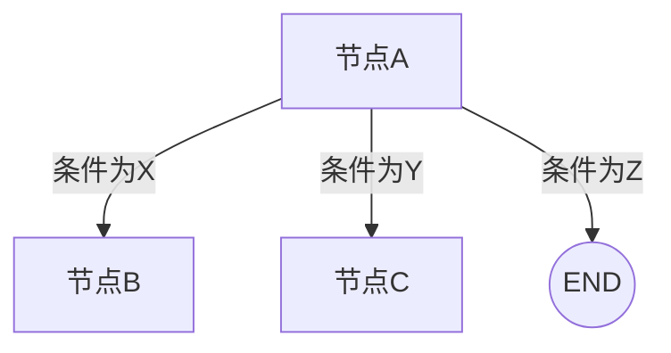
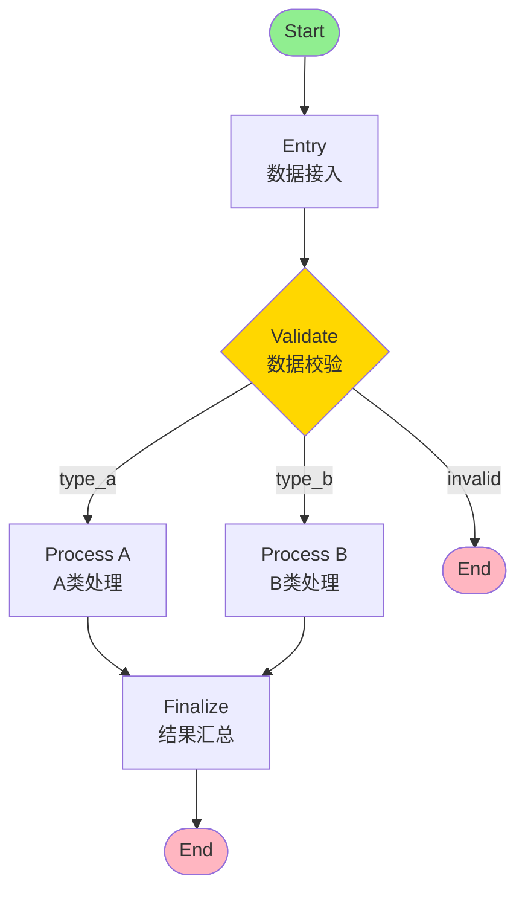
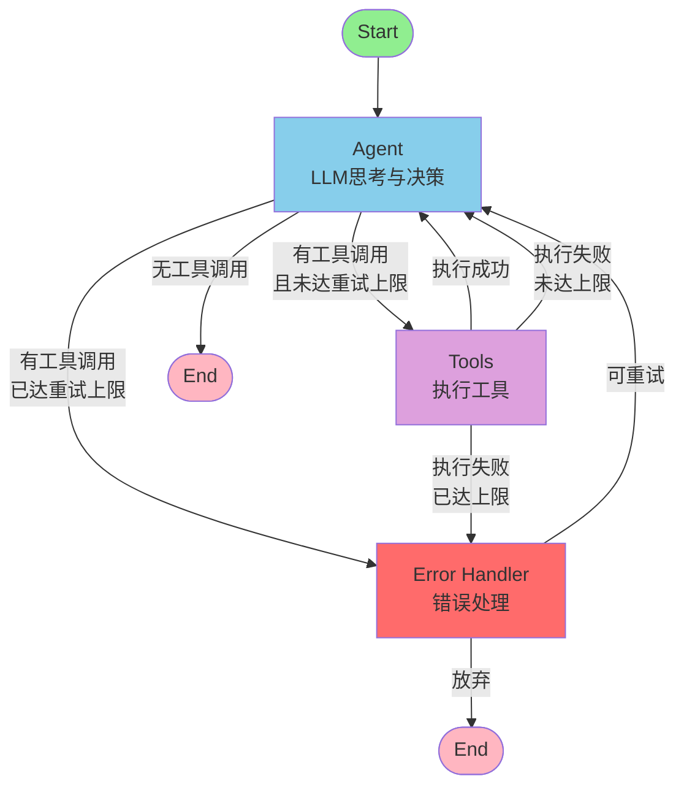

# T06 - 条件分支与边（Conditional Edges）

> **课程来源**：黑马程序员 LangChain 课程 第3章 Agent 进阶
> **参考视频**：[BV178w1z7EHQ](https://www.bilibili.com/video/BV178w1z7EHQ)

---

## 1. 条件边（Conditional Edge）概述

### 1.1 什么是条件边？

在上一章中，我们学习了普通的 `add_edge()` —— 它定义的是**固定的、无条件的**节点转移关系。但在实际的 Agent 应用中，我们经常需要根据运行时的状态来决定下一步该往哪里走。

**条件边（Conditional Edge）** 就是解决这个问题的机制：它允许我们在节点执行完成后，根据当前的 State 动态选择下一个要执行的节点。

### 1.2 为什么需要条件边？

没有条件边的图只能表达线性的、固定顺序的流程：

```
START → A → B → C → END    （死板的线性流程）
```

有了条件边后，我们可以表达：

```
                    ┌→ 节点B (满足条件X)
START → 节点A → 判断?
                    └→ 节点C (满足条件Y)
                    └→ END   (其他情况)
```

这在 Agent 开发中至关重要，因为 Agent 的核心就是 **"思考 → 判断 → 行动"** 的循环逻辑。

### 1.3 条件边在 Agent 中的典型应用

| 场景 | 条件判断 | 分支 |
|------|----------|------|
| **ReAct 循环** | LLM 是否输出了工具调用？ | 有 → 执行工具 / 无 → 返回答案 |
| **错误处理** | 工具执行是否出错？ | 成功 → 继续 / 失败 → 错误处理节点 |
| **循环控制** | 是否达到最大迭代次数？ | 未达上限 → 继续 / 达到 → 强制结束 |
| **路由分发** | 用户意图是什么？ | 查询 → 搜索节点 / 计算 → 计算节点 |
| **审批流程** | 金额是否超阈值？ | 小额 → 自动通过 / 大额 → 人工审批 |

---

## 2. add_conditional_edges() 用法详解

### 2.1 基本语法

```python
graph.add_conditional_edges(
    source_node,           # 源节点名称（字符串）
    path_map,              # 路径映射字典 {条件值: 目标节点}
    condition_function,    # 路由函数（可选，也可用字符串指定状态字段）
    prop_key=None          # 可选：从 state 中提取的字段名
)
```

#### 参数详解

| 参数 | 类型 | 必填 | 说明 |
|------|------|------|------|
| `source_node` | str | 是 | 条件边的起始节点名称 |
| `path_map` | dict | 是 | 映射关系：`{路由函数返回值: 目标节点}` |
| `condition_function` | Callable / str | 是 | 决定走向的函数，或 state 字段名 |
| `prop_key` | str | 否 | 从 state 中提取用于判断的字段 |

### 2.2 最简单的条件边示例

```python
from langgraph.graph import StateGraph, START, END
from typing import TypedDict, Annotated
from langgraph.graph.message import add_messages

# 1. 定义状态
class GraphState(TypedDict):
    messages: Annotated[list, add_messages]
    decision: str  # 存储决策结果

# 2. 定义路由函数
def route_based_on_decision(state: GraphState) -> str:
    """
    路由函数：根据 state 中的 decision 字段决定下一步

    Returns:
        str: 必须返回 path_map 中定义的 key
    """
    decision = state.get("decision", "default")
    return decision

# 3. 构建图
graph = StateGraph(GraphState)

# 添加节点
graph.add_node("process", process_node)
graph.add_node("option_a", node_a)
graph.add_node("option_b", node_b)

# 入口
graph.add_edge(START, "process")

# 关键：添加条件边！
graph.add_conditional_edges(
    "process",                          # 从 process 节点出发
    {                                   # 路径映射表
        "go_a": "option_a",             # 返回 "go_a" → 去 option_a
        "go_b": "option_b",             # 返回 "go_b" → 去 option_b
        "end": END                      # 返回 "end" → 结束
    },
    route_based_on_decision            # 路由函数
)

# 编译
app = graph.compile()
```

### 2.3 路由函数的编写规范

路由函数是条件边的核心，编写时需要遵循以下规则：

```python
def routing_function(state: YourStateType) -> str:
    """
    标准路由函数签名

    规则：
    1. 参数接收完整的 State
    2. 返回值必须是字符串
    3. 返回值必须在 path_map 的 key 中存在
    4. 可以返回特殊的 END 常量表示终止
    """

    # 规则1: 从 state 中提取需要的字段
    messages = state["messages"]
    last_message = messages[-1]

    # 规则2: 进行条件判断
    if hasattr(last_message, 'tool_calls') and last_message.tool_calls:
        result = "continue"  # 需要继续执行工具
    else:
        result = "end"       # 可以结束了

    # 规则3: 返回字符串（必须是 path_map 中的 key）
    return result
```

**常见返回模式**：

```python
# 模式1: 二元判断（最常用）
def should_continue(state) -> str:
    if some_condition(state):
        return "yes"
    return "no"

# 模式2: 多路分支
def route_by_intent(state) -> str:
    intent = classify_intent(state["messages"][-1].content)
    match intent:
        case "search":
            return "search_tool"
        case "calculate":
            return "calc_tool"
        case _:
            return END  # 直接结束

# 模式3: 带计数的循环控制
def check_iteration_limit(state) -> str:
    if state.get("step_count", 0) >= MAX_STEPS:
        return "force_end"
    return "continue_loop"

# 模式4: 基于错误状态的分支
def handle_error_routing(state) -> str:
    if state.get("error"):
        if state["retry_count"] < 3:
            return "retry"
        return "fallback"
    return "normal_flow"
```

---

## 3. ReAct 循环的 LangGraph 实现

ReAct（Reasoning + Acting）是最经典的 Agent 模式。让我们用 LangGraph 的条件边来实现它。

### 3.1 ReAct 模式原理回顾

ReAct 循环的核心思想：

```
┌─────────────────────────────────────────────────────┐
│                   ReAct 循环                         │
│                                                     │
│   ┌──────────┐                                      │
│   │  Think   │  LLM 分析问题，决定是否需要使用工具    │
│   └────┬─────┘                                      │
│        ↓                                           │
│   ┌──────────┐     有 tool_calls?                  │
│   │  Act     │ ──→ 是 → 执行工具 → 获取结果         │
│   └────┬─────┘                                      │
│        ↓ 否                                        │
│   ┌──────────┐                                      │
│   │ Observe  │  将结果反馈给 LLM                     │
│   └────┬─────┘                                      │
│        ↓ （回到 Think，循环直到不需要工具）           │
│   ┌──────────┐                                      │
│   │ Answer   │  输出最终回答                         │
│   └──────────┘                                      │
│                                                     │
└─────────────────────────────────────────────────────┘
```

### 3.2 完整代码实现

```python
# ============================================
# ReAct Agent 完整实现（LangGraph）
# ============================================

from langgraph.graph import StateGraph, START, END
from langgraph.graph.message import add_messages
from typing import TypedDict, Annotated
from langchain_core.messages import (
    SystemMessage,
    HumanMessage,
    AIMessage,
    ToolMessage
)
from langchain_core.tools import tool
from langchain_openai import ChatOpenAI

# ============================================================
# 第一部分：定义工具
# ============================================================

@tool
def search(query: str) -> str:
    """搜索互联网获取信息"""
    # 实际实现中这里会调用搜索 API
    return f"搜索 '{query}' 的结果：Python是一种高级编程语言..."

@tool
def calculate(expression: str) -> str:
    """计算数学表达式"""
    try:
        result = eval(expression)  # 注意：生产环境不要用eval
        return f"计算结果: {result}"
    except Exception as e:
        return f"计算错误: {e}"

# 工具列表
tools = [search, calculate]
tools_by_name = {tool.name: tool for tool in tools}

# ============================================================
# 第二部分：定义状态
# ============================================================

class AgentState(TypedDict):
    """Agent 状态"""
    messages: Annotated[list, add_messages]

# ============================================================
# 第三部分：初始化 LLM 并绑定工具
# ============================================================

llm = ChatOpenAI(model="gpt-4o-mini", temperature=0)
llm_with_tools = llm.bind_tools(tools)

# ============================================================
# 第四部分：定义节点函数
# ============================================================

def agent_node(state: AgentState) -> dict:
    """
    Agent 节点：LLM 思考并决定下一步行动

    可能输出：
    - 包含 tool_calls 的 AIMessage → 需要执行工具
    - 普通 AIMessage → 最终回答
    """
    print(f"[Agent] 思考中... 当前消息数: {len(state['messages'])}")

    # 调用绑定工具的 LLM
    response = llm_with_tools.invoke(state["messages"])

    print(f"[Agent] 决策: {'调用工具' if response.tool_calls else '直接回答'}")

    return {"messages": [response]}

def tool_node(state: AgentState) -> dict:
    """
    工具执行节点：执行 LLM 请求的工具调用
    """
    print("[Tools] 执行工具调用...")

    messages = state["messages"]
    last_message = messages[-1]

    # 执行所有工具调用
    outputs = []
    for tool_call in last_message.tool_calls:
        tool_name = tool_call["name"]
        tool_args = tool_call["args"]
        tool_id = tool_call["id"]

        print(f"[Tools] 执行 {tool_name}({tool_args})")

        # 查找并执行工具
        selected_tool = tools_by_name[tool_name]
        tool_output = selected_tool.invoke(tool_args)

        # 构造 ToolMessage
        outputs.append(
            ToolMessage(
                content=str(tool_output),
                name=tool_name,
                tool_call_id=tool_id
            )
        )

    return {"messages": outputs}

# ============================================================
# 第五部分：定义路由函数（条件边的核心）
# ============================================================

def should_continue(state: AgentState) -> str:
    """
    路由函数：判断 Agent 的输出是否包含工具调用

    这是 ReAct 循环的控制中枢：
    - 如果有 tool_calls → 继续执行工具
    - 如果没有 → 结束循环，返回最终答案
    """
    messages = state["messages"]
    last_message = messages[-1]

    # 关键判断：LLM 的回复是否包含工具调用
    if hasattr(last_message, 'tool_calls') and len(last_message.tool_calls) > 0:
        print(f"[Router] 检测到 {len(last_message.tool_calls)} 个工具调用 → 继续")
        return "tools"  # 去工具执行节点
    else:
        print("[Router] 无工具调用 → 结束")
        return END  # 直接结束

# ============================================================
# 第六部分：构建并编译图
# ============================================================

# 创建图
graph = StateGraph(AgentState)

# 添加节点
graph.add_node("agent", agent_node)
graph.add_node("tools", tool_node)

# 设置入口
graph.add_edge(START, "agent")

# 关键：从 agent 出发的条件边
graph.add_conditional_edges(
    "agent",                    # 源节点
    {                           # 路径映射
        "tools": "tools",      # 返回 "tools" → 去 tools 节点
        END: END               # 返回 END → 结束
    },
    should_continue            # 路由函数
)

# 工具执行完后回到 agent（形成循环）
graph.add_edge("tools", "agent")

# 编译
app = graph.compile()

# ============================================================
# 第七部分：执行测试
# ============================================================

if __name__ == "__main__":
    # 测试1: 需要工具调用的查询
    print("=" * 50)
    print("测试1: 搜索查询")
    print("=" * 50)

    result = app.invoke(
        {
            "messages": [
                SystemMessage(content="你是一个有帮助的AI助手"),
                HumanMessage(content="请帮我搜索一下 Python 的特点")
            ]
        }
    )

    print("\n最终回答:")
    print(result["messages"][-1].content)

    print("\n" + "=" * 50)
    print("测试2: 数学计算")
    print("=" * 50)

    result2 = app.invoke(
        {
            "messages": [
                SystemMessage(content="你是一个有帮助的AI助手"),
                HumanMessage(content="计算 123 * 456 等于多少")
            ]
        }
    )

    print("\n最终回答:")
    print(result2["messages"][-1].content)
```

### 3.3 执行流程可视化

```
用户输入: "搜索 Python 特点"
    ↓
┌─────────────────────────────────────────────────────────────┐
│  START                                                      │
│  State: {messages: [System, Human]}                        │
└─────────────────────────┬───────────────────────────────────┘
                          │
                          ▼
┌─────────────────────────────────────────────────────────────┐
│  agent (第1次)                                              │
│  LLM 思考: "我需要搜索 Python 信息"                         │
│  输出: AIMessage(tool_calls=[search("Python 特点")])        │
│                                                             │
│  → should_continue() 检测到 tool_calls                      │
│  → 返回 "tools"                                             │
└─────────────────────────┬───────────────────────────────────┘
                          │ 条件边: "tools"
                          ▼
┌─────────────────────────────────────────────────────────────┐
│  tools                                                      │
│  执行 search("Python 特点")                                 │
│  输出: ToolMessage("Python是一种高级编程语言...")            │
└─────────────────────────┬───────────────────────────────────┘
                          │ 固定边
                          ▼
┌─────────────────────────────────────────────────────────────┐
│  agent (第2次)                                              │
│  LLM 收到工具结果，综合思考                                  │
│  输出: AIMessage("Python的主要特点包括...")                  │
│  (注意: 这次没有 tool_calls)                                │
│                                                             │
│  → should_continue() 未检测到 tool_calls                    │
│  → 返回 END                                                 │
└─────────────────────────┬───────────────────────────────────┘
                          │ 条件边: END
                          ▼
┌─────────────────────────────────────────────────────────────┐
│  END                                                        │
│  返回最终 State                                             │
└─────────────────────────────────────────────────────────────┘
```

---

## 4. add_edge() vs add_conditional_edges()

理解两者的区别是掌握 LangGraph 图构建的关键。

### 4.1 核心区别对比

| 维度 | add_edge() | add_conditional_edges() |
|------|-----------|------------------------|
| **类型** | 普通边（Static Edge） | 条件边（Conditional Edge） |
| **转移行为** | 总是从 A 到 B（确定性） | 根据 condition 选择目标（动态性） |
| **目标数量** | 单一目标 | 多个可能目标 |
| **语法** | `add_edge(A, B)` | `add_conditional_edges(A, map, func)` |
| **类比** | 单行道 | 带红绿灯的路口 |
| **使用频率** | 用于固定流程 | 用于分支/循环/路由 |

### 4.2 图示对比

**add_edge() —— 固定转移**：


```python
# 无论什么情况，A 执行完一定去 B
graph.add_edge("node_a", "node_b")
```

**add_conditional_edges() —— 动态转移**：



```python
# 根据条件决定去向
graph.add_conditional_edges(
    "node_a",
    {"route_b": "node_b", "route_c": "node_c", "stop": END},
    route_function
)
```

### 4.3 混合使用示例

在实际应用中，两种边通常会配合使用：

```python
graph = StateGraph(MyState)

# 添加节点
graph.add_node("entry", entry_node)
graph.add_node("validate", validate_node)
graph.add_node("process_a", process_a_node)
graph.add_node("process_b", process_b_node)
graph.add_node("finalize", finalize_node)

# 使用普通边：固定入口
graph.add_edge(START, "entry")
graph.add_edge("entry", "validate")

# 使用条件边：验证后的分支
graph.add_conditional_edges(
    "validate",
    {
        "type_a": "process_a",    # 类型A的处理流程
        "type_b": "process_b",    # 类型B的处理流程
        "invalid": END            # 无效输入直接结束
    },
    validate_router
)

# 使用普通边：两个处理流程汇合
graph.add_edge("process_a", "finalize")
graph.add_edge("process_b", "finalize")

# 使用普通边：固定出口
graph.add_edge("finalize", END)
```

对应的图结构：



---

## 5. 路由函数的最佳实践

### 5.1 设计原则

编写高质量的路由函数需要遵循以下原则：

| 原则 | 说明 | 示例 |
|------|------|------|
| **纯函数** | 不修改外部状态，只做判断 | 不要在路由函数里发网络请求 |
| **单一职责** | 只负责路由，不做业务逻辑 | 判断逻辑抽取到独立函数 |
| **可测试** | 输入确定时输出确定 | 方便写单元测试 |
| **明确返回** | 返回值清晰明了 | 使用枚举或常量而非魔法字符串 |
| **防御性编程** | 处理异常情况 | 提供默认 fallback |

### 5.2 推荐的路由函数结构

```python
# 定义路由常量（避免魔法字符串）
ROUTE_TOOLS = "tools"
ROUTE_END = "end"
ROUTE_RETRY = "retry"
ROUTE_FALLBACK = "fallback"

def smart_router(state: AgentState) -> str:
    """
    最佳实践路由函数模板

    Args:
        state: 当前完整状态

    Returns:
        str: 路由目标常量
    """
    try:
        # 1. 安全地获取所需字段
        messages = state.get("messages", [])
        if not messages:
            return ROUTE_FALLBACK

        last_message = messages[-1]

        # 2. 检查迭代次数（防止无限循环）
        iteration = state.get("iteration", 0)
        if iteration >= MAX_ITERATIONS:
            print(f"[Router] 达到最大迭代次数 ({MAX_ITERATIONS})")
            return ROUTE_END

        # 3. 主要路由逻辑
        if hasattr(last_message, 'tool_calls') and last_message.tool_calls:
            # 4. 可选：检查特定条件
            tool_names = [tc["name"] for tc in last_message.tool_calls]

            # 例如：敏感操作需要额外确认
            if any(name in SENSITIVE_TOOLS for name in tool_names):
                return ROUTE_RETRY  # 或走人工审批分支

            return ROUTE_TOOLS

        # 5. 默认返回
        return ROUTE_END

    except Exception as e:
        print(f"[Router] 异常: {e}")
        return ROUTE_FALLBACK
```

### 5.3 基于 match/case 的多路路由（Python 3.10+）

对于复杂的多路分支，使用 `match/case` 语句更加清晰：

```python
def intent_router(state: AgentState) -> str:
    """基于意图的多路路由"""

    # 提取用户意图（可以调用分类器）
    user_input = state["messages"][-1].content
    intent = classify_intent(user_input)  # 假设的分类函数

    match intent:
        case "search":
            return "search_node"
        case "calculate":
            return "calculator_node"
        case "translate":
            return "translator_node"
        case "code":
            return "code_executor"
        case "chat":
            return END  # 普通聊天直接结束
        case _:
            return "clarification_node"  # 不明确的意图
```

### 5.4 从 State 字段直接路由（简化写法）

如果你的状态中已经存储了路由决策，可以直接引用字段名：

```python
class WorkflowState(TypedDict):
    messages: Annotated[list, add_messages]
    next_step: str  # 已经存储了下一步的去向

graph.add_conditional_edges(
    "decision_maker",
    {
        "approve": "approved_handler",
        "reject": "rejected_handler",
        "review": "reviewer_node"
    },
    "next_step"  # 直接指定 state 字段名，无需单独写路由函数！
)
```

> 这种写法等价于：`lambda state: state["next_step"]`

---

## 6. 实战：带错误恢复的智能体

### 6.1 需求描述

构建一个具备以下能力的 Agent：

1. **正常路径**：Agent 思考 → 执行工具 → 继续思考 → 输出答案
2. **错误检测**：工具执行出错时能自动识别
3. **错误恢复**：支持有限次数的重试
4. **降级处理**：重试耗尽后给出友好的错误提示

### 6.2 状态设计

```python
from typing import TypedDict, Annotated
from langgraph.graph.message import add_messages

class RobustAgentState(TypedDict):
    """带错误恢复的 Agent 状态"""

    # 对话消息
    messages: Annotated[list, add_messages]

    # 错误追踪
    error: str | None           # 当前错误信息
    retry_count: int            # 已重试次数
    max_retries: int            # 最大重试次数（默认3次）

    # 流程控制
    status: str                 # current/error/recovered/finished
```

### 6.3 完整实现代码

```python
# ============================================
# 带错误恢复的 ReAct Agent
# ============================================

import json
from langgraph.graph import StateGraph, START, END
from langgraph.graph.message import add_messages
from typing import TypedDict, Annotated, Literal
from langchain_core.messages import (
    SystemMessage,
    HumanMessage,
    AIMessage,
    ToolMessage
)
from langchain_core.tools import tool
from langchain_openai import ChatOpenAI

# ============================================================
# 配置常量
# ============================================================

MAX_RETRIES = 3  # 最大重试次数

# 路由常量
ROUTE_TOOLS = "execute_tools"
ROUTE_ERROR_HANDLER = "handle_error"
ROUTE_END = "end"

# ============================================================
# 工具定义（包含可能失败的工具）
# ============================================================

@tool
def reliable_search(query: str) -> str:
    """可靠的搜索工具"""
    return f"关于'{query}'的搜索结果：这是一些有用的信息..."

@tool
def unreliable_api(data: str) -> str:
    """模拟可能失败的 API（50%概率失败）"""
    import random
    if random.random() < 0.5:
        raise ConnectionError("API 服务暂时不可用")
    return f"API 处理成功: {data}"

@tool
def calculator(expr: str) -> str:
    """安全计算器"""
    try:
        # 仅允许基本运算
        allowed = set('0123456789+-*/().% ')
        if all(c in allowed for c in expr):
            return f"结果: {eval(expr)}"
        return "错误: 表达式中包含不允许的字符"
    except Exception as e:
        return f"计算错误: {e}"

tools = [reliable_search, unreliable_api, calculator]
tools_by_name = {t.name: t for t in tools}

# ============================================================
# 状态定义
# ============================================================

class RobustAgentState(TypedDict):
    messages: Annotated[list, add_messages]
    error: str | None
    retry_count: int

# ============================================================
# LLM 初始化
# ============================================================

llm = ChatOpenAI(model="gpt-4o-mini", temperature=0)
llm_with_tools = llm.bind_tools(tools)

# ============================================================
# 节点函数
# ============================================================

def agent_node(state: RobustAgentState) -> dict:
    """
    Agent 节点：LLM 思考和决策
    """
    print(f"\n{'='*50}")
    print(f"[Agent] 第 {state.get('retry_count', 0) + 1} 轮思考")
    print(f"{'='*50}")

    # 如果有之前的错误，在系统提示中注入错误信息
    messages = list(state["messages"])

    if state.get("error"):
        # 在消息前插入错误上下文
        error_context = SystemMessage(
            content=f"⚠️ 上一步执行出错: {state['error']}\n"
                   f"请尝试其他方法或换一种方式完成用户的请求。"
                   f"已重试 {state['retry_count']}/{MAX_RETRIES} 次。"
        )
        messages.insert(1, error_context)  # 在 system 之后插入
        print(f"[Agent] 检测到历史错误，已注入错误上下文")

    response = llm_with_tools.invoke(messages)

    action = "调用工具" if response.tool_calls else "生成回答"
    print(f"[Agent] 决策: {action}")

    return {"messages": [response], "error": None}

def tool_executor_node(state: RobustAgentState) -> dict:
    """
    工具执行节点：执行 LLM 请求的工具调用，带错误捕获
    """
    print("\n[Tools] 开始执行工具...")
    messages = state["messages"]
    last_message = messages[-1]

    outputs = []
    errors = []

    for tool_call in last_message.tool_calls:
        tool_name = tool_call["name"]
        tool_args = tool_call["args"]

        print(f"[Tools] → {tool_name}({tool_args})")

        try:
            # 执行工具
            selected_tool = tools_by_name[tool_name]
            result = selected_tool.invoke(tool_args)

            print(f"[Tools] ✓ 成功: {result[:50]}...")

            outputs.append(
                ToolMessage(
                    content=str(result),
                    name=tool_name,
                    tool_call_id=tool_call["id"]
                )
            )

        except Exception as e:
            error_msg = f"{tool_name} 执行失败: {str(e)}"
            print(f"[Tools] ✗ 错误: {error_msg}")
            errors.append(error_msg)

            # 即使出错也返回 ToolMessage，但内容是错误信息
            outputs.append(
                ToolMessage(
                    content=f"ERROR: {error_msg}",
                    name=tool_name,
                    tool_call_id=tool_call["id"]
                )
            )

    update = {"messages": outputs}

    # 如果有错误，记录到状态
    if errors:
        new_retry_count = state.get("retry_count", 0) + 1
        update["error"] = "; ".join(errors)
        update["retry_count"] = new_retry_count
        print(f"[Tools] 记录错误，重试次数: {new_retry_count}/{MAX_RETRIES}")

    return update

def error_handler_node(state: RobustAgentState) -> dict:
    """
    错误处理节点：决定是重试还是放弃
    """
    retry_count = state.get("retry_count", 0)
    error = state.get("error", "未知错误")

    print(f"\n[ErrorHandler] 处理错误...")
    print(f"[ErrorHandler] 重试次数: {retry_count}/{MAX_RETRIES}")

    if retry_count >= MAX_RETRIES:
        print(f"[ErrorHandler] ⚠ 达到最大重试次数，生成降级响应")
        fallback_msg = AIMessage(
            content=f"抱歉，在尝试了 {MAX_RETRIES} 次后仍然遇到问题: "
                   f"{error}\n\n建议您稍后重试，或者换一个请求试试。"
        )
        return {"messages": [fallback_msg], "error": None}
    else:
        print(f"[ErrorHandler] 允许继续重试 ({MAX_RETRIES - retry_count} 次剩余)")
        return {}  # 不修改状态，让路由函数决定回到 agent

# ============================================================
# 路由函数
# ============================================================

def robust_router(state: RobustAgentState) -> str:
    """
    增强版路由函数：考虑错误状态
    """
    messages = state["messages"]
    last_message = messages[-1]

    # 检查是否有工具调用
    has_tool_calls = (
        hasattr(last_message, 'tool_calls')
        and len(last_message.tool_calls) > 0
    )

    # 检查是否有未处理的错误
    has_error = state.get("error") is not None
    retry_count = state.get("retry_count", 0)

    # 路由逻辑
    if has_tool_calls:
        # 有工具调用 → 检查是否应该进入错误恢复模式
        if has_error and retry_count >= MAX_RETRIES:
            return ROUTE_ERROR_HANDLER  # 重试耗尽
        return ROUTE_TOOLS  # 正常执行工具
    else:
        # 无工具调用 → 正常结束
        return ROUTE_END

def after_tools_router(state: RobustAgentState) -> str:
    """
    工具执行后的路由：检查是否出错
    """
    if state.get("error"):
        if state["retry_count"] >= MAX_RETRIES:
            return ROUTE_ERROR_HANDLER
        return "agent"  # 回到 agent 重试
    return "agent"  # 无错误，正常回到 agent

# ============================================================
# 构建图
# ============================================================

graph = StateGraph(RobustAgentState)

# 节点
graph.add_node("agent", agent_node)
graph.add_node("tools", tool_executor_node)
graph.add_node("error_handler", error_handler_node)

# 边
graph.add_edge(START, "agent")

# Agent 出发的条件边
graph.add_conditional_edges(
    "agent",
    {
        ROUTE_TOOLS: "tools",
        ROUTE_ERROR_HANDLER: "error_handler",
        ROUTE_END: END
    },
    robust_router
)

# Tools 出发后的条件边
graph.add_conditional_edges(
    "tools",
    {
        "agent": "agent",
        ROUTE_ERROR_HANDLER: "error_handler",
        ROUTE_END: END
    },
    after_tools_router
)

# Error handler 后的条件边
graph.add_conditional_edges(
    "error_handler",
    {
        "agent": "agent",  # 重试
        ROUTE_END: END     # 放弃
    },
    lambda s: "agent" if s.get("retry_count", 0) < MAX_RETRIES else ROUTE_END
)

# 编译
app = graph.compile()

# ============================================================
# 测试
# ============================================================

if __name__ == "__main__":
    print("=" * 60)
    print("带错误恢复的 ReAct Agent 测试")
    print("=" * 60)

    test_queries = [
        "帮我搜索一下人工智能的发展历史",
        "调用那个不可靠的 API 测试一下",  # 可能触发错误恢复
        "计算 (100 + 200) * 3",
    ]

    for i, query in enumerate(test_queries, 1):
        print(f"\n{'#' * 60}")
        print(f"# 测试 {i}: {query}")
        print(f"{'#' * 60}")

        result = app.invoke({
            "messages": [
                SystemMessage(content="你是一个有帮助的AI助手"),
                HumanMessage(content=query)
            ],
            "error": None,
            "retry_count": 0
        })

        print(f"\n{'#' * 60}")
        print(f"# 最终回答:")
        print(f"{'#' * 60}")
        print(result["messages"][-1].content)
        print()
```

### 6.4 图结构可视化



### 6.5 执行流程示例（触发错误恢复）

```
======================================================================
测试: 调用那个不可靠的 API 测试一下
======================================================================

==================================================
[Agent] 第 1 轮思考
==================================================
[Agent] 决策: 调用工具

[Tools] 开始执行...
[Tools] → unreliable_api({'data': 'test'})
[Tools] ✗ 错误: unreliable_api 执行失败: API 服务暂时不可用
[Tools] 记录错误，重试次数: 1/3

==================================================
[Agent] 第 2 轮思考
==================================================
[Agent] 检测到历史错误，已注入错误上下文
[Agent] 决策: 调用工具

[Tools] 开始执行...
[Tools] → unreliable_api({'data': 'test'})
[Tools] ✓ 成功: API 处理成功: test
[Tools] 开始执行...

==================================================
[Agent] 第 3 轮思考
==================================================
[Agent] 决策: 生成回答
[Router] 无工具调用 → 结束

======================================================================
最终回答:
我已经成功调用了 API 进行测试...
======================================================================
```

---

## 7. 本章小结

本章深入学习了 LangGraph 的条件分支机制，核心要点包括：

1. **条件边的价值**：将 Agent 的"思考-判断-行动"循环显式化，使流程可控可调试

2. **核心 API**：`add_conditional_edges(source, path_map, condition_func)` 是构建动态流程的关键方法

3. **路由函数设计**：
   - 接收完整 State 作为参数
   - 返回字符串（对应 path_map 的 key）
   - 支持 END 常量表示终止
   - 推荐使用常量替代魔法字符串

4. **ReAct 循环实现**：Agent 节点（LLM 决策）+ Tools 节点（执行工具）+ 条件边（判断是否继续），三者配合形成完整的推理-行动循环

5. **与普通边的配合**：固定流程用 `add_edge()`，分支/循环用 `add_conditional_edges()`，两者混合使用构建复杂工作流

6. **实战进阶**：通过错误恢复机制展示条件边的强大能力 —— 支持重试、降级、多路径容错

下一章我们将学习 **Human-in-the-loop（HITL）断点机制**，让 Agent 能够在关键时刻暂停等待人类介入~

---

## 参考来源

- **视频教程**：[黑马程序员 LangChain 课程](https://www.bilibili.com/video/BV178w1z7EHQ) - 第3章 Agent 进阶
- **官方文档**：[LangGraph Conditional Edges](https://langchain-ai.github.io/langgraph/concepts/low_level/#conditional-edges)
- **ReAct 论文**：Yao et al., "ReAct: Synergizing Reasoning and Acting in Language Models" (2023)
