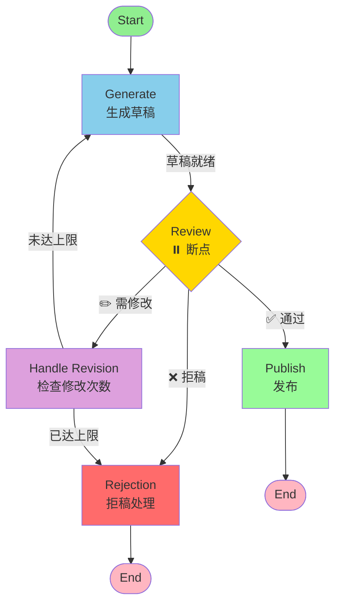

# T07 - Human-in-the-loop（HITL）断点机制

> **课程来源**：黑马程序员 LangChain 课程 第3章 Agent 进阶
> **参考视频**：[BV178w1z7EHQ](https://www.bilibili.com/video/BV178w1z7EHQ)

---

## 1. Human-in-the-loop（HITL）概述

### 1.1 什么是 HITL？

**Human-in-the-loop（人机协同/人在回路）** 是一种系统设计模式，指在自动化流程中的关键节点引入人类决策。在 AI Agent 的语境下，这意味着：

- Agent 在执行到某些关键步骤时 **自动暂停**
- 等待人类 **审核、确认或修改**
- 收到人类的指令后 **继续执行**

```
传统 Agent 流程：
用户请求 → [Agent 自动执行全部] → 返回结果
                ↓ 完全自主，无干预

HITL Agent 流程：
用户请求 → [Agent 执行] → ⏸️ 暂停 → 👤 人类介入 → [Agent 继续] → 结果
                              ↑
                         关键节点断点
```

### 1.2 为什么需要 HITL？

| 场景 | 风险 | HITL 的价值 |
|------|------|------------|
| **敏感操作** | 删除数据、发送邮件、资金转账 | 人工确认，防止误操作 |
| **内容生成** | AI 可能输出不当内容 | 人工审核，保证质量合规 |
| **高风险决策** | 医疗诊断、法律建议 | 专业人员把关，降低风险 |
| **调试开发** | Agent 行为不符合预期 | 逐步审查，定位问题 |
| **学习训练** | 新员工学习 Agent 操作 | 观察并纠正，加速上手 |

### 1.3 LangGraph 的 HITL 实现

LangGraph 通过 **Breakpoint（断点）** 机制原生支持 HITL：

```python
# 核心概念：在图的特定位置设置"暂停点"
# 当执行到达断点时，图会暂停并等待外部指令

app = graph.compile(
    interrupt_before=["sensitive_node"],   # 在节点前暂停
    interrupt_after=["review_node"]         # 在节点后暂停
)
```

---

## 2. interrupt_before / interrupt_after 基础用法

### 2.1 编译时静态断点

最简单的断点方式是在 `compile()` 时指定：

```python
from langgraph.graph import StateGraph, START, END
from langgraph.graph.message import add_messages
from typing import TypedDict, Annotated
import json

# ============================================================
# 示例：邮件发送 Agent（需要审批）
# ============================================================

class EmailState(TypedDict):
    messages: Annotated[list, add_messages]
    email_subject: str
    email_body: str
    recipient: str
    approved: bool

def draft_email(state: EmailState) -> dict:
    """起草邮件"""
    # LLM 根据对话历史起草邮件
    return {
        "email_subject": "项目进度更新",
        "email_body": "尊敬的领导...",
        "recipient": "boss@company.com"
    }

def send_email(state: EmailState) -> dict:
    """发送邮件（敏感操作！）"""
    print(f"📧 正在发送邮件至 {state['recipient']}")
    print(f"   主题: {state['email_subject']}")
    # 实际的邮件发送逻辑...
    return {"messages": [{"role": "assistant", "content": "邮件已发送"}]}

# 构建图
graph = StateGraph(EmailState)
graph.add_node("draft", draft_email)
graph.add_node("send", send_email)

graph.add_edge(START, "draft")
graph.add_edge("draft", "send")
graph.add_edge("send", END)

# ============================================================
# 关键：编译时设置断点
# ============================================================

app = graph.compile(
    interrupt_before=["send"]  # 在 send 节点执行前暂停！
)
```

### 2.2 执行与恢复

```python
import asyncio
from langgraph.types import Command

async def demo_hitl():
    config = {"configurable": {"thread_id": "email-thread-001"}}

    # 第一次调用：执行到断点处暂停
    print("=" * 50)
    print("第1步：执行到断点")
    print("=" * 50)

    result = await app.ainvoke(
        {
            "messages": [{"role": "user", "content": "帮我给老板发封邮件"}]
        },
        config=config
    )

    print("\n当前状态（已暂停）：")
    print(json.dumps(result, indent=2, ensure_ascii=False, default=str))

    # 检查是否处于暂停状态
    state = await app.aget_state(config)
    print(f"\n⏸️ 图是否暂停: {state.next is not None}")  # True 表示暂停
    print(f"   下一个待执行节点: {state.next}")

    # ============================================================
    # 人类在此介入！查看邮件内容并决定是否批准
    # ============================================================

    print("\n" + "=" * 50)
    print("第2步：人类介入 - 审批邮件")
    print("=" * 50)
    print(f"收件人: {result['recipient']}")
    print(f"主题: {result['email_subject']}")
    print(f"正文预览: {result['email_body'][:100]}...")

    # 模拟人类批准操作
    user_decision = input("\n是否批准发送？(yes/no): ")

    if user_decision.lower() == "yes":
        # 使用 Command 恢复执行
        print("\n✅ 用户批准，继续执行...")

        resume_result = await app.ainvoke(
            Command(resume="approved"),  # 传递恢复信号
            config=config
        )

        print("\n最终结果:")
        print(resume_result["messages"][-1]["content"])
    else:
        print("\n❌ 用户拒绝，取消发送")

# 运行演示
# asyncio.run(demo_hitl())
```

### 2.3 interrupt() 函数 —— 动态断点

除了编译时的静态断点，LangGraph 还支持在函数内部动态设置断点：

```python
from langgraph.types import interrupt

@tool
def delete_database_record(record_id: str) -> str:
    """
    危险操作：删除数据库记录！

    此操作不可逆，必须经过人工确认
    """
    # 设置动态断点：暂停执行，等待人类确认
    human_response = interrupt(value={
        "action": "DELETE_RECORD",
        "record_id": record_id,
        "warning": "此操作不可逆！",
        "requires": "confirmation"
    })

    # human_response 包含人类的响应
    if human_response == "confirmed":
        # 执行删除
        actual_delete(record_id)
        return f"记录 {record_id} 已删除"
    else:
        return f"删除操作被取消: {human_response}"
```

### 2.4 interrupt() 的详细用法

```python
from langgraph.types import interrupt

def sensitive_operation_node(state):
    """包含多个断点的复杂节点"""

    # 步骤1：准备数据
    data = prepare_data(state["input"])

    # 断点1：确认数据正确性
    check_result = interrupt(value={
        "type": "data_review",
        "data_summary": data[:200],
        "question": "数据是否正确？"
    })
    # 程序在此暂停，直到收到人类回复
    # check_result 就是人类的回复内容

    if check_result != "confirmed":
        return {"status": "cancelled", "reason": "data_rejected"}

    # 步骤2：执行核心操作
    result = process_data(data)

    # 断点2：确认结果可接受
    final_check = interrupt(value={
        "type": "result_approval",
        "result_preview": str(result)[:200],
        "question": "结果是否可以提交？"
    })

    return {
        "status": "completed" if final_check == "approved" else "rejected",
        "result": result
    }
```

---

## 3. 断点的类型详解

### 3.1 三种断点类型对比

| 类型 | API | 触发时机 | 典型用途 | 控制粒度 |
|------|-----|----------|---------|---------|
| **interrupt_before** | compile() 参数 | 节点开始执行前 | 操作前的权限确认 | 节点级 |
| **interrupt_after** | compile() 参数 | 节点执行完成后 | 结果的审核验收 | 节点级 |
| **interrupt()** | 函数内调用 | 函数执行过程中的任意位置 | 细粒度的交互式确认 | 代码级 |

### 3.2 interrupt_before —— 执行前确认

```python
# 场景：金融交易前的风控审批

class TradeState(TypedDict):
    messages: Annotated[list, add_messages]
    trade_details: dict
    risk_score: float
    approved: bool

def prepare_trade(state: TradeState) -> dict:
    """准备交易"""
    trade = analyze_trade_intent(state["messages"])
    risk = calculate_risk(trade)
    return {
        "trade_details": trade,
        "risk_score": risk
    }

def execute_trade(state: TradeState) -> dict:
    """执行交易"""
    execute_on_exchange(state["trade_details"])
    return {"approved": True}

# 编译时设置：在高风险交易执行前暂停
trading_app = StateGraph(TradeState)
trading_app.add_node("prepare", prepare_trade)
trading_app.add_node("execute", execute_trade)
trading_app.add_edge(START, "prepare")
trading_app.add_edge("prepare", "execute")
trading_app.add_edge("execute", END)

# 关键：在 execute 节点前中断
compiled_app = trading_app.compile(
    interrupt_before=["execute"]
)

# 使用示例
config = {"configurable": {"thread_id": "trade-001"}}

# 第一次调用：会在 execute 前暂停
state1 = compiled_app.invoke({"messages": [...]}, config=config)
# 此时可以检查 trade_details 和 risk_score

# 人类审批后恢复
if approve_trade(state1["trade_details"], state1["risk_score"]):
    final_state = compiled_app.invoke(Command(resume=True), config=config)
```

### 3.3 interrupt_after —— 执行后审核

```python
# 场景：AI 生成内容的审核

class ContentState(TypedDict):
    messages: Annotated[list, add_messages]
    generated_content: str
    review_status: str  # pending/approved/rejected/revision_needed

def generate_content(state: ContentState) -> dict:
    """AI 生成内容"""
    content = llm.invoke(state["messages"]).content
    return {"generated_content": content}

def publish_content(state: ContentState) -> dict:
    """发布内容"""
    publish_to_platform(state["generated_content"])
    return {"review_status": "published"}

content_graph = StateGraph(ContentState)
content_graph.add_node("generate", generate_content)
content_graph.add_node("publish", publish_content)
content_graph.add_edge(START, "generate")
content_graph.add_edge("generate", "publish")
content_graph.add_edge("publish", END)

# 在 generate 之后、publish 之前暂停
content_app = content_graph.compile(
    interrupt_after=["generate"]  # 内容生成后等待审核
)
```

### 3.4 动态断点 interrupt()

动态断点提供最灵活的控制能力：

```python
from langgraph.types import interrupt

class MultiStepState(TypedDict):
    messages: Annotated[list, add_messages]
    step: int
    confirmations: list

def complex_workflow(state: MultiStepState) -> dict:
    """多步骤工作流，每步都需要确认"""

    confirmations = state.get("confirmations", [])

    # === 第一步：数据验证 ===
    if state["step"] == 1:
        data = fetch_external_data()

        # 动态断点1
        validation = interrupt({
            "step": 1,
            "action": "validate_data",
            "data_preview": data[:500],
            "prompt": "请验证以上数据是否准确"
        })

        if validation != "valid":
            return {"step": 0, "confirmations": [*confirmations, f"step1:{validation}"]}
        confirmations.append("step1:validated")

    # === 第二步：处理数据 ===
    if state["step"] <= 2:
        processed = process_data()

        # 动态断点2
        processing_check = interrupt({
            "step": 2,
            "action": "check_processing",
            "summary": processed.summary(),
            "prompt": "处理结果是否符合预期？"
        })

        if processing_check == "retry":
            return {"step": 1, "confirmations": confirmations}  # 回退重试
        confirmations.append("step2:approved")

    # === 第三步：最终提交 ===
    final_confirm = interrupt({
        "step": 3,
        "action": "final_submit",
        "all_confirmations": confirmations,
        "prompt": "所有步骤已完成，是否最终提交？"
    })

    submit() if final_confirm == "submit" else rollback()

    return {
        "step": 4,
        "confirmations": [*confirmations, f"step3:{final_confirm}"]
    }
```

---

## 4. 断点后的恢复流程

### 4.1 Command 对象

当图在断点处暂停后，使用 `Command` 对象来恢复执行：

```python
from langgraph.types import Command

# Command 的主要用法:

# 1. 简单恢复（不带额外数据）
Command(resume="approved")       # 传递一个值给 interrupt()
Command(resume=True)             # 传递布尔值
Command(resume=None)             # 不传值，仅继续

# 2. 带数据的恢复（传递修正信息）
Command(resume={
    "decision": "approve_with_changes",
    "modifications": "请将标题改为..."
})

# 3. 跳转到其他节点（高级用法）
Command(goto="alternative_node", update={"new_data": ...})
```

### 4.2 完整的恢复流程

```python
import asyncio
from langgraph.types import Command
from langgraph.checkpoint.memory import MemorySaver

async def full_hitl_workflow():
    """
    完整的 HITL 工作流演示
    """

    # 需要配置 Checkpointer 才能支持断点功能
    checkpointer = MemorySaver()

    app = build_agent_graph().compile(
        checkpointer=checkpointer,
        interrupt_before=["sensitive_action"]
    )

    config = {"configurable": {"thread_id": "demo-001"}}
    thread_id = config["configurable"]["thread_id"]

    # ========== 第一阶段：运行到断点 ==========
    print("🚀 启动 Agent...")
    initial_state = await app.ainvoke(
        {"messages": [{"role": "user", "content": "执行敏感操作"}]},
        config=config
    )

    # ========== 第二阶段：检查暂停状态 ==========
    current_state = await app.aget_state(config)

    print(f"\n⏸️  当前状态:")
    print(f"   任务: {current_state.values.get('task_description')}")
    print(f"   下一步: {current_state.next}")  # ['sensitive_action']
    print(f"   是否暂停: {current_state.next is not None}")

    # ========== 第三阶段：人类介入 ==========
    print("\n👤 人类介入环节")
    print("-" * 40)

    # 展示待确认的信息
    task_info = current_state.values
    print(f"待执行的操作: {task_info.get('pending_action')}")
    print(f"影响范围: {task_info.get('impact_scope')}")

    # 模拟人类决策
    decision = await get_human_decision(task_info)  # 可以是UI输入/API调用

    # ========== 第四阶段：根据决策恢复 ==========
    if decision["action"] == "approve":
        print("\n✅ 批准，恢复执行...")

        # 方式A：简单恢复
        final_state = await app.ainvoke(
            Command(resume="approved"),
            config=config
        )

    elif decision["action"] == "modify":
        print("\n✏️  带修改恢复...")

        # 方式B：带修正数据的恢复
        final_state = await app.ainvoke(
            Command(resume=decision["modifications"]),
            config=config
        )

    elif decision["action"] == "reject":
        print("\n❌ 拒绝，终止流程")

        # 方式C：拒绝后可以选择走其他分支
        final_state = await app.ainvoke(
            Command(resume="rejected"),
            config=config
        )

    # ========== 第五阶段：获取最终结果 ==========
    print("\n📋 最终结果:")
    final = await app.aget_state(config)
    print(json.dumps(final.values, indent=2, ensure_ascii=False, default=str))

# asyncio.run(full_hitl_workflow())
```

### 4.3 恭复时的状态更新

恢复时不仅可以传递简单的确认值，还可以更新状态：

```python
# 场景：人类审核后修改了 AI 生成的内容

# 第一次执行：AI 生成内容后在断点暂停
state1 = app.invoke(input_data, config=config)
# state1.generated_content = "原始生成的文章..."

# 人类审核后要求修改
human_feedback = {
    "action": "revise",
    "changes": [
        {"section": "title", "new_value": "修改后的标题"},
        {"section": "conclusion", "instruction": "更加积极正面"}
    ]
}

# 恢复执行，同时传入修改指令
state2 = app.invoke(
    Command(resume=human_feedback),
    config=config
)
# Agent 会根据 feedback 修改内容后再继续
```

---

## 5. 动态断点（Dynamic Breakpoints）

### 5.1 基于条件的动态断点

有时我们不想固定在某个节点断点，而是希望根据运行时状态决定是否暂停：

```python
def should_interrupt_based_on_amount(state: dict) -> list:
    """
    动态断点判断函数

    Returns:
        list: 需要中断的节点名称列表（空列表表示不中断）
    """
    amount = state.get("transaction_amount", 0)
    threshold = 10000  # 1万元阈值

    if amount >= threshold:
        print(f"💰 大额交易 ({amount} > {threshold})，需要人工审批")
        return ["execute_transaction"]  # 在此节点前中断
    else:
        print(f"💵 小额交易 ({amount})，自动通过")
        return []  # 不中断

# 编译时传入动态断点函数
app = graph.compile(
    interrupt_before=should_interrupt_based_on_amount
)
```

### 5.2 多条件组合的动态断点

```python
def smart_interrupt_before(state: dict) -> list:
    """智能断点：多种条件组合判断"""
    nodes_to_interrupt = []

    # 条件1：金额超限
    if state.get("amount", 0) > 10000:
        nodes_to_interrupt.append("payment")

    # 条件2：首次交易的客户
    if state.get("is_new_customer", False):
        nodes_to_interrupt.append("verify_identity")

    # 条件3：异常行为检测
    if state.get("risk_flag", False):
        nodes_to_interrupt.extend(["manual_review", "compliance_check"])

    # 条件4：特定时间段的大额操作
    from datetime import datetime
    hour = datetime.now().hour
    if state.get("amount", 0) > 50000 and (hour < 9 or hour > 18):
        nodes_to_interrupt.append("overtime_approval")

    return nodes_to_interrupt

app = graph.compile(interrupt_before=smart_interrupt_before)
```

### 5.3 动态断点的实际效果

```python
# 测试不同场景

# 场景1：小额交易 → 无断点
result1 = app.invoke(
    {"amount": 100, "is_new_customer": False},
    config=config
)
# 直接完成，无需人工介入 ✓

# 场景2：大额交易 → payment 节点前暂停
result2 = app.invoke(
    {"amount": 50000, "is_new_customer": False},
    config=config
)
# 在 payment 前暂停 ⏸️

# 场景3：新客户 + 中等金额 → 多个断点
result3 = app.invoke(
    {"amount": 5000, "is_new_customer": True},
    config=config
)
# 在 verify_identity 前暂停 ⏸️
```

---

## 6. 实战案例：内容审核 Agent

### 6.1 需求描述

构建一个 AI 内容生成平台的工作流：

1. AI 根据用户需求生成文章草稿
2. **断点**：等待编辑审核
3. 编辑可选择：通过 / 打回修改 / 直接拒稿
4. 若打回修改，AI 根据意见重新生成
5. 最终发布

### 6.2 完整实现代码

```python
# ============================================
# 内容审核 Agent（完整实现）
# ============================================

from typing import TypedDict, Annotated, Literal
from langgraph.graph import StateGraph, START, END
from langgraph.graph.message import add_messages
from langgraph.types import interrupt, Command
from langgraph.checkpoint.memory import MemorySaver
from langchain_core.messages import SystemMessage, HumanMessage, AIMessage
from langchain_openai import ChatOpenAI
import json
import asyncio

# ============================================================
# 配置
# ============================================================

llm = ChatOpenAI(model="gpt-4o-mini", temperature=0.7)

MAX_REVISIONS = 3  # 最大修改轮次

# ============================================================
# 状态定义
# ============================================================

class ContentReviewState(TypedDict):
    """内容审核工作流的状态"""

    # 对话消息
    messages: Annotated[list, add_messages]

    # 内容相关
    topic: str                  # 文章主题
    draft: str                  # 当前草稿
    revision_count: int         # 已修改次数

    # 审核状态
    review_status: Literal["pending", "approved", "rejected", "needs_revision"]
    review_feedback: str        # 审核意见
    reviewer: str               # 审核人

    # 发布信息
    published_url: str | None

# ============================================================
# 节点函数
# ============================================================

def generate_draft_node(state: ContentReviewState) -> dict:
    """
    草稿生成节点：根据主题和要求生成文章
    """
    topic = state["topic"]
    revision = state.get("revision_count", 0)

    print(f"\n{'='*50}")
    print(f"[Generate] 生成草稿 (第 {revision + 1} 版)")
    print(f"{'='*50}")

    # 构建提示词
    if revision > 0 and state.get("review_feedback"):
        # 如果是修改版，融入之前的反馈
        prompt = f"""请根据以下反馈修改文章：

主题：{topic}
上一版反馈：{state['review_feedback']}

请生成修改后的完整文章。注意直接输出文章内容，不要解释。
"""
    else:
        prompt = f"""请为以下主题撰写一篇高质量的文章：

主题：{topic}

要求：
- 结构清晰，逻辑严谨
- 语言流畅专业
- 字数在800-1200字之间

请直接输出文章内容，不要添加任何解释性文字。
"""

    # 调用 LLM 生成
    response = llm.invoke([
        SystemMessage(content="你是一位专业的内容创作者"),
        HumanMessage(content=prompt)
    ])

    draft = response.content

    print(f"[Generate] 草稿已生成 ({len(draft)} 字符)")
    print(f"[Generate] 前100字: {draft[:100]}...")

    return {
        "draft": draft,
        "review_status": "pending",
        "revision_count": revision + 1
    }

def review_node(state: ContentReviewState) -> dict:
    """
    审核节点（模拟）：在实际应用中这里是人类操作的界面
    但为了演示，我们在节点内部使用 interrupt()
    """
    print(f"\n{'='*50}")
    print(f"[Review] 进入审核环节")
    print(f"{'='*50}")

    draft = state["draft"]
    revision = state["revision_count"]

    print(f"[Review] 当前是第 {revision} 版草稿")
    print(f"\n--- 草稿内容 ---")
    print(draft[:500] + "..." if len(draft) > 500 else draft)
    print("--- 结束 ---\n")

    # ============================================================
    # 关键：设置断点，等待人类审核
    # ============================================================
    review_result = interrupt(value={
        "type": "content_review",
        "version": revision,
        "draft_length": len(draft),
        "draft_preview": draft[:300],
        "options": ["approve", "reject", "request_revision"],
        "max_revisions": MAX_REVISIONS,
        "remaining_revisions": MAX_REVISIONS - revision + 1
    })

    # 收到人类审核结果后继续执行
    print(f"\n[Review] 收到审核结果: {review_result}")

    # 解析审核结果
    if isinstance(review_result, dict):
        decision = review_result.get("decision", "reject")
        feedback = review_result.get("feedback", "")
        reviewer = review_result.get("reviewer", "anonymous")
    else:
        # 简单字符串格式
        decision = review_result
        feedback = ""
        reviewer = "anonymous"

    status_map = {
        "approve": "approved",
        "reject": "rejected",
        "request_revision": "needs_revision"
    }

    return {
        "review_status": status_map.get(decision, "rejected"),
        "review_feedback": feedback,
        "reviewer": reviewer
    }

def publish_node(state: ContentReviewState) -> dict:
    """
    发布节点：将审核通过的文章发布
    """
    print(f"\n{'='*50}")
    print(f"[Publish] 发布文章")
    print(f"{'='*50}")

    # 模拟发布过程
    import hashlib
    url_hash = hashlib.md5(state["draft"].encode()).hexdigest()[:8]
    published_url = f"https://blog.example.com/articles/{url_hash}"

    print(f"[Publish] 发布成功!")
    print(f"[Publish] URL: {published_url}")

    return {
        "published_url": published_url,
        "messages": [AIMessage(content=f"文章已成功发布: {published_url}")]
    }

def handle_revision_node(state: ContentReviewState) -> dict:
    """
    修改处理节点：决定是否允许继续修改
    """
    revision_count = state["revision_count"]

    print(f"\n[Revision] 当前已修改 {revision_count} 次")

    if revision_count >= MAX_REVISIONS:
        print(f"[Revision] ⚠ 达到最大修改次数 ({MAX_REVISIONS})")
        return {
            "review_status": "rejected",
            "messages": [AIMessage(
                content=f"已达到最大修改次数({MAX_REVISIONS}次)，文章已被拒稿。"
            )]
        }

    print(f"[Revision] 还可以修改 {MAX_REVISIONS - revision_count} 次")
    return {}  # 状态不变，回到 generate

def rejection_handler_node(state: ContentReviewState) -> dict:
    """
    拒稿处理节点
    """
    print(f"\n[Reject] 文章已被拒稿")
    return {
        "messages": [AIMessage(
            content=f"文章已被 {state.get('reviewer', '审核人')} 拒稿。"
                   f"\n原因: {state.get('review_feedback', '未提供原因')}"
        )]
    }

# ============================================================
# 路由函数
# ============================================================

def review_router(state: ContentReviewState) -> str:
    """审核后的路由"""
    status = state["review_status"]

    match status:
        case "approved":
            return "publish"
        case "needs_revision":
            return "handle_revision"
        case "rejected":
            return "rejection"
        case _:
            return "rejection"

def revision_router(state: ContentReviewState) -> str:
    """修改处理后的路由"""
    if state["review_status"] == "rejected":
        return "rejection"
    return "generate"  # 回去重新生成

# ============================================================
# 构建图
# ============================================================

def build_content_review_graph():
    """构建内容审核工作流图"""

    graph = StateGraph(ContentReviewState)

    # 添加节点
    graph.add_node("generate", generate_draft_node)
    graph.add_node("review", review_node)
    graph.add_node("publish", publish_node)
    graph.add_node("handle_revision", handle_revision_node)
    graph.add_node("rejection", rejection_handler_node)

    # 边定义
    graph.add_edge(START, "generate")
    graph.add_edge("generate", "review")  # 生成后进入审核

    # 审核后的条件分支
    graph.add_conditional_edges(
        "review",
        {
            "publish": "publish",
            "handle_revision": "handle_revision",
            "rejection": "rejection"
        },
        review_router
    )

    # 修改处理后的路由
    graph.add_conditional_edges(
        "handle_revision",
        {
            "generate": "generate",
            "rejection": "rejection"
        },
        revision_router
    )

    # 终止边
    graph.add_edge("publish", END)
    graph.add_edge("rejection", END)

    return graph

# ============================================================
# 主程序：演示完整的 HITL 流程
# ============================================================

async def main():
    """主程序"""

    # 创建图并编译（需要 checkpointer 支持 HITL）
    checkpointer = MemorySaver()
    graph = build_content_review_graph()

    app = graph.compile(
        checkpointer=checkpointer
        # 注意：这里不需要显式设置 interrupt_before/after
        # 因为我们在 review_node 内部使用了 interrupt() 动态断点
    )

    config = {"configurable": {"thread_id": "content-review-001"}}

    # ========================================
    # 开始执行
    # ========================================

    print("=" * 60)
    print("内容审核 Agent - HITL 演示")
    print("=" * 60)

    # 第一次调用：会执行到 review 节点的 interrupt() 处暂停
    print("\n>>> 提交写作任务...\n")

    try:
        state1 = await app.ainvoke(
            {
                "topic": "人工智能在教育领域的应用前景",
                "messages": [HumanMessage(content="写一篇关于AI教育的文章")]
            },
            config=config
        )
    except Exception as e:
        # interrupt() 会抛出 GraphInterrupt 异常
        print(f"\n⏸️  图已在断点处暂停")
        print(f"   异常类型: {type(e).__name__}")

    # ========================================
    # 获取当前状态
    # ========================================

    current_state = await app.aget_state(config)

    print(f"\n{'='*50}")
    print(f"当前状态快照")
    print(f"{'='*50}")
    print(f"主题: {current_state.values['topic']}")
    print(f"草稿长度: {len(current_state.values['draft'])} 字符")
    print(f"版本: 第 {current_state.values['revision_count']} 版")
    print(f"下一个节点: {current_state.next}")
    print(f"是否暂停: {'是' if current_state.next else '否'}")

    # ========================================
    # 模拟人类审核（第一轮：打回修改）
    # ========================================

    print(f"\n{'='*50}")
    print(f"👤 编辑审核中 (第1轮)")
    print(f"{'='*50}")

    first_review_decision = {
        "decision": "request_revision",
        "feedback": "文章结构不错，但以下方面需要改进:\n"
                    "1. 缺少具体案例和数据支撑\n"
                    "2. 结论部分过于简略\n"
                    "3. 请增加对未来趋势的展望",
        "reviewer": "张编辑"
    }

    print(f"审核决定: {first_review_decision['decision']}")
    print(f"审核意见: {first_review_decision['feedback'][:100]}...")

    # 恢复执行，传入审核结果
    print("\n>>> 提交审核结果，继续执行...\n")

    try:
        state2 = await app.ainvoke(
            Command(resume=first_review_decision),
            config=config
        )
    except Exception as e:
        print(f"\n⏸️  再次暂停 (如果触发了新的断点)")

    # ========================================
    # 第二轮审核：再次打回
    # ========================================

    current_state = await app.aget_state(config)

    if current_state.next:  # 如果还在暂停
        print(f"\n{'='*50}")
        print(f"👤 编辑审核中 (第2轮)")
        print(f"{'='*50}")

        second_review_decision = {
            "decision": "request_revision",
            "feedback": "改进明显! 还有一个小问题:\n"
                        "第三部分的语言可以更精炼一些。",
            "reviewer": "张编辑"
        }

        print(f"审核决定: {second_review_decision['decision']}")

        try:
            await app.ainvoke(
                Command(resume=second_review_decision),
                config=config
            )
        except Exception:
            pass

    # ========================================
    # 第三轮审核：通过
    # ========================================

    current_state = await app.aget_state(config)

    if current_state.next:
        print(f"\n{'='*50}")
        print(f"👤 编辑审核中 (第3轮)")
        print(f"{'='*50}")

        final_review_decision = {
            "decision": "approve",
            "feedback": "很好，这篇文章可以发布了!",
            "reviewer": "张编辑"
        }

        print(f"审核决定: ✅ {final_review_decision['decision']}")

        # 最终恢复
        final_state = await app.ainvoke(
            Command(resume=final_review_decision),
            config=config
        )

        print(f"\n{'='*60}")
        print(f"🎉 工作流完成!")
        print(f"{'='*60}")
        print(f"最终状态: {final_state['review_status']}")
        print(f"发布链接: {final_state.get('published_url', 'N/A')}")
        print(f"总修改轮次: {final_state['revision_count']}")
    else:
        # 已经执行完毕
        final_state = (await app.aget_state(config)).values
        print(f"\n最终状态: {final_state.get('review_status')}")

# 运行
# asyncio.run(main())
```

### 6.3 图结构可视化



### 6.4 执行流程示意

```
================================================================================
内容审核 Agent - HITL 演示
================================================================================

>>> 提交写作任务...

==================================================
[Generate] 生成草稿 (第 1 版)
==================================================
[Generate] 草稿已生成 (1234 字符)

[Review] 进入审核环节
⏸️  图已在断点处暂停

======================================================================
当前状态快照
======================================================================
主题: 人工智能在教育领域的应用前景
草稿长度: 1234 字符
版本: 第 1 版
下一个节点: ['review']
是否暂停: 是

======================================================================
👤 编辑审核中 (第1轮)
======================================================================
审核决定: request_revision
审核意见: 文章结构不错，但以下方面需要改进...

>>> 提交审核结果，继续执行...

==================================================
[Generate] 生成草稿 (第 2 版)
==================================================
[Generate] 根据反馈重新生成...

[Review] 进入审核环节
⏸️  再次暂停

======================================================================
👤 编辑审核中 (第2轮)
======================================================================
审核决定: request_revision

>>> 继续执行...

==================================================
[Generate] 生成草稿 (第 3 版)
==================================================

[Review] 进入审核环节
⏸️  暂停

======================================================================
👤 编辑审核中 (第3轮)
======================================================================
审核决定: ✅ approve

>>> 最终恢复...

[Publish] 发布文章
[Publish] 发布成功!
[Publish] URL: https://blog.example.com/articles/a1b2c3d4

================================================================================
🎉 工作流完成!
================================================================================
最终状态: approved
发布链接: https://blog.example.com/articles/a1b2c3d4
总修改轮次: 3
================================================================================
```

---

## 7. HITL 最佳实践总结

### 7.1 设计原则

| 原则 | 说明 | 反例 |
|------|------|------|
| **最小化打断** | 只在真正必要的节点设断点 | 每个节点都设断点 |
| **清晰上下文** | 给审核者提供充分的上下文信息 | 只显示"同意/拒绝" |
| **幂等性** | 恢复执行后重复调用应安全 | 恢复后产生副作用 |
| **超时处理** | 设定等待人类响应的超时时间 | 无限期等待 |
| **审计日志** | 记录所有人工决策 | 无法追溯谁做了什么决定 |

### 7.2 断点选择指南

```
应该在何时设置断点？

┌─────────────────────────────────────────────────────┐
│                                                     │
│  必须设置断点:                                      │
│  ├─ 💰 涉及资金操作                                 │
│  ├─ 🗑️ 不可逆的数据删除                             │
│  ├─ 📧 外部通信（邮件/消息）                        │
│  ├─ 🔐 敏感信息访问                                 │
│  └─ 📝 内容公开发布前                               │
│                                                     │
│  可选设置断点:                                      │
│  ├─ 🔄 关键决策点                                   │
│  ├─ 📊 重要数据处理前后                             │
│  └─ 🎯 与外部系统集成时                             │
│                                                     │
│  通常不需要断点:                                    │
│  ├─ 数据查询/读取                                   │
│  ├─ 内部计算/转换                                   │
│  └─ 日志记录                                        │
│                                                     │
└─────────────────────────────────────────────────────┘
```

### 7.3 生产环境注意事项

| 注意事项 | 说明 | 建议 |
|---------|------|------|
| **Checkpointer** | HITL 必须配合持久化的 Checkpointer | 使用 PostgresSaver / SqliteSaver |
| **权限控制** | 谁有权恢复执行？ | 集成认证系统，记录操作者身份 |
| **通知机制** | 断点触发后如何通知审核者？ | Webhook / 邮件 / 即时消息 |
| **界面集成** | 审核者如何查看和操作？ | 构建 Web UI 或使用控制台 |
| **并发安全** | 同一 thread 的并发恢复 | 加锁或使用队列 |

---

## 8. 本章小结

本章深入学习了 LangGraph 的 Human-in-the-loop（HITL）断点机制，核心要点包括：

1. **HITL 的价值**：在 Agent 的关键节点引入人工决策，平衡自动化效率与人工把控

2. **三种断点方式**：
   - `interrupt_before`（编译时）：节点执行前暂停，适用于操作前确认
   - `interrupt_after`（编译时）：节点执行后暂停，适用于结果审核
   - `interrupt()`（运行时）：函数内部任意位置暂停，最灵活但需手动管理

3. **恢复机制**：使用 `Command(resume=value)` 恢复执行，value 可以是简单的确认字符串，也可以是包含修改信息的复杂数据

4. **动态断点**：通过返回节点列表的函数实现基于运行时状态的智能断点，如按金额大小决定是否需要审批

5. **实战案例**：完整的内容审核 Agent 展示了多轮"生成-审核-修改-再审核"的协作流程

6. **生产要点**：HITL 需要 Checkpointer 支持状态持久化，生产环境还需考虑权限控制、通知机制和审计日志

下一章我们将探索 LangGraph 的另一个强大特性 —— **时间旅行与状态编辑**，让我们能够回溯和修改历史的执行状态~

---

## 参考来源

- **视频教程**：[黑马程序员 LangChain 课程](https://www.bilibili.com/video/BV178w1z7EHQ) - 第3章 Agent 进阶
- **官方文档**：[LangGraph Human-in-the-loop](https://langchain-ai.github.io/langgraph/how-tos/human_in_the_loop/)
- **官方文档**：[LangGraph Breakpoints](https://langchain-ai.github.io/langgraph/concepts/low_level/#breakpoints)
